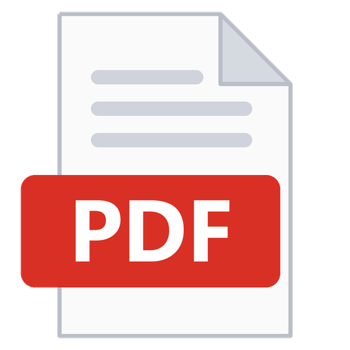
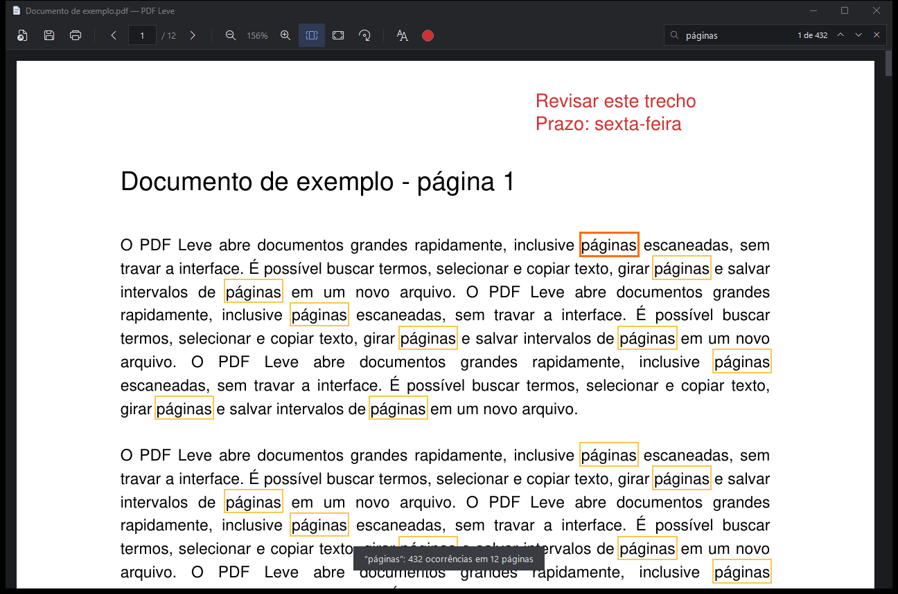

<p align="center">
  
</p>

<h1 align="center">PDF Leve</h1>

<p align="center">
  Leitor de PDF leve para Windows, com tema escuro, anotações de texto e foco total no documento.
</p>

<p align="center">
  
</p>

## Por quê?

Navegadores e leitores tradicionais consomem muita memória e disco para uma tarefa simples: ler
PDFs. O PDF Leve foi feito para documentos grandes — como processos judiciais com centenas de
páginas escaneadas — abrindo rápido e sem travar a tela.

## Recursos

- **Leve e rápido**: páginas escaneadas (JPEG 2000, JBIG2…) são renderizadas em processos
  auxiliares, e a interface nunca trava; as próximas páginas já vão sendo preparadas enquanto você lê.
- **Várias janelas**: cada PDF abre na sua própria janela, todas no mesmo programa (instância única).
- **Anotações de texto coloridas**, salvas no próprio PDF no padrão do formato — aparecem também no
  Chrome, no Adobe e em outros leitores.
- **Seleção e cópia de texto**, inclusive em páginas com OCR e entre páginas diferentes.
- **Busca em segundo plano** com contador de ocorrências (“3 de 27”).
- **Salvar páginas em PDF** (todas, a atual ou intervalos como `1-5, 8, 11-13`).
- **Girar páginas**, **tela cheia**, **página inteira** / **ajuste à largura**.
- **Arrastar e soltar** arquivos na janela.
- Tema escuro, interface minimalista, barra de título escura no Windows 10/11.

## Download (Windows 10/11, sem instalar Python)

1. Baixe o `PDF-Leve-<versão>-windows-x64.zip` na página de
   [Releases](https://github.com/fernando13razec/leitor-de-pdf-leve/releases/latest).
2. Extraia o zip numa pasta de sua preferência (ex.: `C:\Programas\PDF Leve`).
   Mantenha o `PDF Leve.exe` junto da pasta `_internal`.
3. Abra o `PDF Leve.exe`.

> O executável não tem assinatura digital; na primeira execução o Windows pode mostrar
> “O Windows protegeu o computador”. Clique em **Mais informações → Executar assim mesmo**.

**Para abrir PDFs com duplo clique:** clique com o botão direito num PDF → **Abrir com** →
**Escolher outro aplicativo** → **Procurar um aplicativo neste PC** → selecione o `PDF Leve.exe`
e marque **Sempre**. Cada PDF abrirá em uma nova janela do programa.

## Executar a partir do código-fonte

Requisitos: Windows 10 ou 11, Python 3.10 ou superior (testado com 3.14) e
[PyMuPDF](https://pymupdf.readthedocs.io/) — a interface usa o `tkinter`, que já vem com o Python.

```bash
git clone https://github.com/fernando13razec/leitor-de-pdf-leve.git
cd leitor-de-pdf-leve
pip install -r requirements.txt
```

## Uso

Dê um duplo clique em `iniciar.pyw`, ou pela linha de comando:

```bash
pythonw iniciar.pyw "C:\caminho\do\arquivo.pdf"
```

Também é possível executar como módulo: `python -m pdf_leve arquivo.pdf`.

### Atalhos

| Atalho | Ação |
|---|---|
| `Ctrl+O` / `Ctrl+N` | Abrir PDFs (vários de uma vez) / nova janela vazia |
| `Ctrl+S` / `Ctrl+Shift+S` | Salvar / salvar como |
| `Ctrl+P` | Salvar páginas em um novo PDF |
| `→` / `←` | Próxima / página anterior |
| `↓` / `↑`, `PageDown` / `PageUp` | Rolar |
| `Home` / `End` | Primeira / última página |
| `Ctrl+1` / `Ctrl+2` | Ajustar à largura / página inteira |
| `Ctrl +` / `Ctrl −` / `Ctrl+0`, `Ctrl + roda` | Zoom |
| `Ctrl+→` / `Ctrl+←` (com `Shift`: todas) | Girar página |
| `T` | Modo texto (clique na página para anotar) |
| Duplo clique / `Delete` / botão direito | Editar / excluir / menu da anotação |
| Arrastar · duplo clique · triplo clique | Selecionar texto · palavra · linha |
| `Ctrl+C` | Copiar texto selecionado |
| Botão do meio + arrastar | Mover a página |
| `Ctrl+F`, `Enter` / `Shift+Enter` | Buscar, próximo / anterior |
| `F11` | Tela cheia |
| `Esc` | Desfazer seleção → sair do modo texto → sair da tela cheia → limpar busca |

## Desenvolvimento

```bash
pip install -r requirements-dev.txt
python -m unittest discover -s testes -t . -v   # testes automáticos
python ferramentas/gerar_icone.py               # recria o ícone (vermelho, “PDF”) em recursos/
python ferramentas/gerar_executavel.py          # gera dist/PDF Leve/ e o .zip da Release
```

A organização do código está descrita em [docs/arquitetura.md](docs/arquitetura.md).

**Lançar uma versão:** atualize `VERSAO` em `pdf_leve/configuracao/constantes.py`, descreva as
novidades no [CHANGELOG.md](CHANGELOG.md), faça o commit e
envie uma tag (`git tag v1.0.1 && git push origin v1.0.1`). O GitHub Actions testa, gera o
executável e publica a Release. A assinatura de código está descrita em
[docs/assinatura-de-codigo.md](docs/assinatura-de-codigo.md).

## Licença

[MIT](LICENSE) © 2026 Fernando Santos
